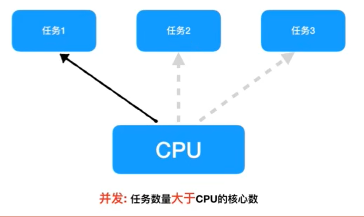
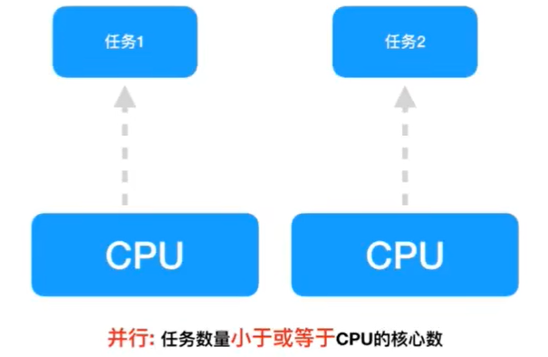

# 一、多任务

## 1.1 多任务的概念

​	多任务是指在同一时间内执行多个任务。

## 1.2 多任务的优势

​	多任务的最好好处是充分利用CPU资源，提高程序的执行效率。

## 1.3 多任务的两种表现形式

### 1.3.1 并发

​	概念：在一段时间内交替去执行多个任务。

​	例子： 对于单核cpu处理多任务，操作系统轮流让各个任务交替执行。



### 1.3.2 并行

​	概念：在一段时间内真正的同时一起执行多个任务。

​	例子： 对于多核cpu处理多任务，操作系统会给cpu的每个内核安排一个执行的任务，多个内核是真正的一起同时执行多个任务。这里需要注意多核cpu是并行的执行多任务，始终有多个任务一起执行。



# 二、线程

如果一个程序想同时执行多个部分的代码，那么基本有两种方式实现，线程、进程。

##  2.1 什么是线程

​	线程是一个抽象的概念，可以把它想象成程序在执行代码时的那个执行流。

	1. 当一个程序运行时，默认有一个线程，这个线程我们称之为主线程。
	2. 多任务也可以理解为让代码在运行的过程再额外创建一些线程，让这些线程去执行代码。

## 2.2 通过线程实现多任务

​		在Python中如果想使用线程实现多任务，可以使用thread模块，但是它比较底层，即意味着较为复杂不方便使用，推荐使用threading模块，它是对thread做了一些包装的，可以更加方便使用。

## 2.3 使用threading模块

**多个线程执行不同的代码**

```
'''
多个线程执行不同的代码

'''

# 1. 导入threading模块
import threading
import time

def task_l1():
    while True:
        print("111111")
        time.sleep(1)

def task_l2():
    while True:
        print("222222")
        time.sleep(0.2)

def task_l3():
    while True:
        print("333333")
        time.sleep(1)

# 2. 使用threading模块中的Thread创建一个对象
t1 = threading.Thread(target=task_l1)   # 子线程1
t2 = threading.Thread(target=task_l2)   # 子线程2
t3 = threading.Thread(target=task_l3)  # 子线程3


# 3. 调用这个实例对象的start方法让这个线程开始运行
t1.start()
t2.start()
t3.start()

while True:  # 主线程执行
    print("---主主主---")
    time.sleep(1)

# 操作系统来决定 主线程、子线程谁先执行打印。
```

**多个线程执行相同的代码**

```
'''
多个线程执行相同的代码
'''

import time
import threading

def say_sorry():
    for i in range(5):
        print("I am sorry")
        time.sleep(1)

t1 = threading.Thread(target=say_sorry)
t2 = threading.Thread(target=say_sorry)

t1.start()
t2.start()


'''
小结:
1.一个程序中，可以有多个线程,执行相同的代码,但是每个线程执行每个线程的功能，互不影响，仅仅是做的事情相同罢了

2.当在创建Thread对象是target执行的函数的代码执行完之后，意味着这个子线程结束。

3.虽然主线程没有了代码，但是它依然会等待所有的子线程结束之后它才会真正的结束，
原因是:主线程有个特殊的功能用来对子线程产生的垃圾进行回收处理。

4.当主线程接收之后,才意味着整个程序真正的结束。

'''
```

**多线程执行的顺序**

​		多线程执行的顺序是不确定，因为在执行代码的时候当前的运行环境可能不同以及资源的分配可能不同，导致了操作系统在计算接下来应该调用那个程序的时候得到了不一样的答案，因此顺序不确定。

```
import threading
from time import sleep

def test1():
    '''
    这是一个单独的任务
    :return:
    '''
    for i in range(10):
        print("任务1...%d" % i)
        sleep(0.1)

def test2():
    '''
    这是另外一个单独的任务
    :return:
    '''
    for i in range(5):
        print("任务2...%d" % i)
        sleep(0.2)

t1 = threading.Thread(target=test1)
t2 = threading.Thread(target=test2)

t1.start()
t2.start()
```

## 2.4 创建线程时传递参数

​		为了能够在创建线程时，让这个线程执行不一样的事情，可以在使用threading Thread创建线程时，传递一些参数给它，这样就让这个线程更加通用了。

```
import threading
import time


def print_lines(num):
    for i in range(num):
        print("1111")
        time.sleep(0.1)

def print_lines2(num1, num2):
    for i in range(num1):
        print('222')
        time.sleep(0.1)

    for i in range(num2):
        print('3333')
        time.sleep(0.1)

def work2(num1, num2, num3, n):
    print("----in work1--num1=%d, num2=%d, num3=%d, n=%d ---" % (num1, num2, num3, n))

t1 = threading.Thread(target=print_lines, args=(5,))
t2 = threading.Thread(target=print_lines2, args=(3, 4))
t3 = threading.Thread(target=work2, args=(11, 22, 33), kwargs={"n": 44})

t1.start()
t2.start()
t3.start()

```

## 2.5 自定义类创建线程

1. 定义一个新的类，继承Thread类
2. 在这个类中实现run方法
3. 在run方法中写要执行的代码
4. 当使用这个类创建一个对象后，调用对象的start方法就可以让这个线程执行，且会自动执行run方法的代码。
5. 如果出现了run方法之外还定义了很多其它的方法，例如xx，那么这些方法需要在run方法中自己去调用。线程它自己不会调用。

```
import threading
import time

class Task(threading.Thread):
    def run(self):
        while True:
            print("1111")
            time.sleep(1)

t = Task()
t.start()

while True:
    print("main")
    time.sleep(1)
```

# 三、队列（Queue）

​	多任务程序，有很多时候，需要相互配合才能完成一件有意义的事情。

​	例如：一个线程专门用来接受数据，另外一个线程专门用来存储刚刚接受的数据。

​	如果需要将以上2个线程相互配合，那么理论上来说， 效率会很高，但是线程中的变量各自是各自的，为了能够让多个线程之间共享某些数据，就可以使用队列来实现数据共享。

## 3.1 什么是队列

​	一种特殊的存储数据的方式，可以实现先存入的数据，先出去。

## 3.2 队列Queue

```
import queue

q = queue.Queue()
q.put('11')  # 存入字符串
q.put(22)  # 存入整数
q.put({'num': 100}) # 存入字典
q.put(['123', '456'])  # 存入列表

print(q.get())  # 11
print(q.get())  # 22
print(q.get())  # {'num': 100}
print(q.get())  # ['123', '456']

'''
小结：
1. 先进先出 （FIFO） first in first out
2. 可以存放任意类型数据
'''
```

## 3.3 堆栈Queue

```
import queue
q = queue.LifoQueue()
q.put('11')  # 存入字符串
q.put(22)  # 存入整数
q.put({'num': 100}) # 存入字典
q.put(['123', '456'])  # 存入列表

print(q.get())  # ['123', '456']
print(q.get())  # {'num': 100}
print(q.get())  # 22
print(q.get())  # 11

'''
1. 后进先出（LIFO） last in first out
2. 可以存放任意数据类型
'''

```

## 3.4 优先级Queue

```
import queue

q = queue.PriorityQueue()
q.put((10, 'Q'))
q.put((30, 'Z'))
q.put((20, 'A'))

print(q.get())  # (10, 'Q')
print(q.get())  # (20, 'A')
print(q.get())  # (30, 'Z')

'''
小结：
1. 存放的数据是元祖类型，第1个元素表示优先级，第2个元素表示存储的数据。
2. 优先级数字越小优先级越高。
3. 数据优先级高的优先被取出。
4. 用于VIP用户数据优先被取出的场景。因为上面两种都要挨个取出。
'''
```

# 四、互斥锁

## 4.1 线程之间共享全局变量

```
import threading
import time

# 1. 定义一个全局变量
g_num = 0

# 2. 定义2个函数，用它们来充当线程要执行的代码
def task1():
    global g_num
    g_num = 100
    print("在task1中, g_num=%d" % g_num)

def task2():
    print("在task2中, g_num=%d" % g_num)

# 3. 创建线程对象
t1 = threading.Thread(target=task1)
t2 = threading.Thread(target=task2)

# 4. 调用start创建线程，让线程开始运行。
t1.start()

time.sleep(2)  # 让主线程延时一会儿，保证让task1这个任务执行完毕。

t2.start()

'''
小结：
1. 如果一个程序有多个线程，每个线程可以单独执行自己的任务。
2. 如果多个线程之间需要数据共享，最简单的方式是，通过全局变量来实现。
其中一个线程修改全局变量，另外一个线程从全局变量中获取数据。

注意：
1. 通过全局变量可以解决多个线程之间共享数据的问题。但是如果使用不够切当，会导致数据错乱。
例如有3个线程:
其中第1、2个修改全局变量，第3个线程获取全局变量的值，可能会出现第1个线程刚刚将数据存放到了全局变量中，本意是想让
第3个线程获取它的数据，因为操作系统的调度原因导致了线程3没有被调度，而第2个线程被调度了，恰巧第2个线程也对全局变量进行了修改
当第3个线程去读取数据的时候，读取到的是第2个线程的数据而不是在第1个线程的数据。


'''
```

## 4.2 资源竞争问题

```
import threading
import time

# 1. 定义一个全局变量
g_num = 0


# 2. 定义2个函数，用它们来充当线程要执行的代码
def task1(num):
    global g_num
    for i in range(num):
        g_num += 1
    print("在task1中, g_num=%d" % g_num)


def task2(num):
    global g_num
    for i in range(num):
        g_num += 1
    print("在task1中, g_num=%d" % g_num)


# 3. 创建线程对象
t1 = threading.Thread(target=task1, args=(1000000, ))
t2 = threading.Thread(target=task2, args=(1000000, ))

# 4. 调用start创建线程，让线程开始运行。
t1.start()
t2.start()

'''

# 程序有时并行、有时串行。
# g_num +=1应该是一个整体的功能即—气呵成,但是操作系统在执行这个本应该一次
# 性全部执行的代码时刚执行了一部分，反而去执行其他线程的代码，导致了这样的问题产生

'''
```

## 4.3 使用互斥锁的原因

​	当多个线程几乎同时修改某一个共享数据的时候，需要进行同步锁定。

​	线程同步能够保证多个线程安全访问竞争资源，最简单的同步机制是引入互斥锁。

## 4.4 互斥锁的作用

​	互斥锁为资源引入一个状态：锁定/非锁定。

​	某个线程要更改共享数据时，先将其锁定，此时资源的状态为“锁定”，其它线程不能更改：直至该线程释放资源，将该资源的状态变成“非锁定”，其它的线程才能再次锁定该资源。互斥锁保证了每次只有一个线程进行写入操作，从而保证了多线程情况下数据的正确性。

# 五、进程

程序：例如xxx.exe是一个程序，是一个静态的、一堆代码的称呼。


进程：一个程序运行起来后，代码 +  用到的资源 称之为进程，它是操作系统分配资源的基本单元。

## 5.1  通过Process实现多任务

​		multiprocessing模块是跨平台版本的多进程模块﹐提供了一个Process类来创建一个进程对象﹐这个对象可以理解为是一个独立的进程，可以执行另外的事情。

```
from multiprocessing import Process
import time


class MyNewProcess(Process):
    def run(self):
        while True:
            print("---1---")
            time.sleep(1)


if __name__ == '__main__':
    p = MyNewProcess()
    # 调用p.start()方法，p会先去父类中寻找start(), 然后再Process的start()方法中调用run犯法
    p.start()

    while True:
        print('---main---')
        time.sleep(1)
```

## 5.2 创建线程对象时传递参数

```
import multiprocessing

def task(name, age, **kwargs):
    print("name", name)
    print("age", age)
    print(kwargs)


if __name__ == '__main__':

    p = multiprocessing.Process(target=task, args=("xiaohong", 18), kwargs={"mm": 10})
    p.start()
```

## 5.3 比较进程和线程

通俗理解进程、线程

- 进程，能够完成多任务，比如一台电脑上能够同时运行多个QQ。
- 线程，能够完成多任务，比如一个QQ上的多个聊天窗口。

**定义的不同**：

- 进程是系统进行资源分配和调度的一个独立单位。
- 线程是进程的一个实体，是CPU调度和分派的基本单元，它是比进程更小的能独立运行的基本单位，线程自己基本上不拥有系统资源，只拥有一点在运行中的资源（如程序计数器，一组寄存器和栈），但是它可与同属一个进程的其它线程共享进程所拥有的全部资源。

**区别：**

- 一个程序至少有一个进程，一个进程至少有一个线程。
- 线程的划分尺度小于进程（资源比进程少），使得多线程程序的并发性高。
- 进程在执行过程中拥有独立的内存单元，而多个线程共享内存，从而极大地提高了程序的运行效率。

```
import multiprocessing
import time

num = 100

def task1():
    global num
    num = 200  # 要修改全局变量的值
    print("----in task1, num is %d " % num)


def task2():
    print("----in task2, num is %d" % num)


if __name__ == '__main__':
    p1 = multiprocessing.Process(target=task1)
    p2 = multiprocessing.Process(target=task2)

    # 先让p1标记的进程执行
    p1.start()

    # 让主进程延时1秒钟，保证在这个1秒钟内，p1标记的进程执行完毕代码。
    time.sleep(1)

    # 让p2标记的进程开始运行，看看获取的值是否是200
    p2.start()


'''
进程之间不共享全局变量
1. 当创建一个子进程的时候，会复制父进程的很多东西（全局变量等）
2. 子进程和主进程是单独的2个进程，不是一个。当一个进程结束的时候，不会对其它的进程产生影响。

线程之间共享全局变量。所有的线程都在一个进程汇总，这个进程是主进程。

'''

```

## 5.4 进程间通信-Queue

​	进程之间是独立的，所有的数据各自用各自的，因此为了能够让这些进程之间共享数据，不能使用全局变量，可以使用Linux (Unix)给出的解决办法：

- 进程间通信（IPC）
  1. 管道
  2. 命名管道
  3. socket : 能够实现多台电脑上的进程间通信
- 为了更加简单的实现进程间的通信，可以使用队列Queue

```
import multiprocessing
import time


def task1(q):
    for i in ['A', 'B', 'C']:
        q.put(i)


def task2(q):
    while True:
        time.sleep(0.5)

        if not q.empty():
            value = q.get()
            print("提取出来的数据是：", value)
        else:
            break


if __name__ == '__main__':
    q = multiprocessing.Queue()

    p1 = multiprocessing.Process(target=task1, args=(q, ))
    p2 = multiprocessing.Process(target=task2, args=(q, ))

    p1.start()
    p2.start()
```

# 六、进程池

## 6.1 创建进程池方式

```
from multiprocessing import Pool
import os
import random
import time


def work(num):
    for i in range(5):
        print('===pid=%d==num%d' % (os.getpid(), num))
        time.sleep(1)


if __name__ == '__main__':

    # 3表示进程池中最多有三个进程一起执行
    pool = Pool(3)

    for i in range(10):
        print('----%d----' % i)
        #  向进程中添加 任务
        # 注意： 如果添加的任务数量超过了进程池中进程的个数的话，那么就不会接着往进程池中添加，
        # 如果还没有执行的话，他就会等待前面的进程结束，然后再往进程池中添加新进程。
        pool.apply_async(work, (i, ))

    pool.close()  # 关闭进程池
    pool.join()  # 主进程在这里等待，只有子进程全部结束之后，才会开启主线程。
```


